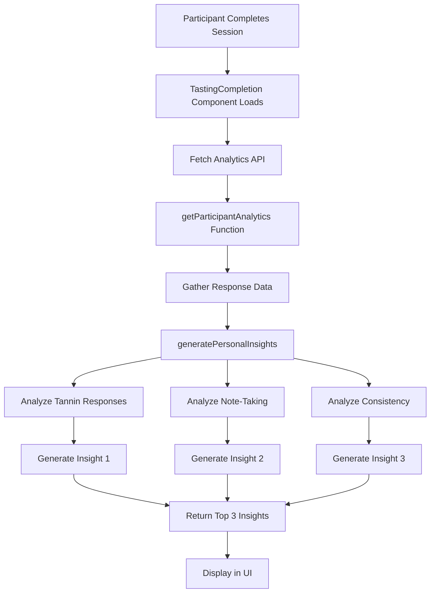

# Key Insights Generation: Comprehensive Documentation

## Table of Contents
1. [Overview](#overview)
2. [Current Implementation](#current-implementation)
3. [Data Flow Architecture](#data-flow-architecture)
4. [Insight Generation Logic](#insight-generation-logic)
5. [Frontend Display](#frontend-display)
6. [Related Analytics Features](#related-analytics-features)
7. [Technical Details](#technical-details)
8. [Expansion Opportunities](#expansion-opportunities)
9. [Code References](#code-references)

## Overview

The "Key Insights" feature is a personalized analytics system that provides participants with meaningful feedback about their wine tasting experience at the end of their session. Currently, the system generates three key insights based on the participant's responses, displayed in the "Your Summary" tab of the completion screen.

### Current Status
- **Backend**: Fully implemented and functional
- **Frontend**: Displays insights but wrapped in a "Coming Soon" overlay
- **Data Source**: Real-time analysis of participant responses
- **Insight Count**: Fixed at 3 insights per session

## Current Implementation

### 1. Backend Architecture

The key insights are generated through the following components:

#### Primary Storage Function
**File**: `server/storage.ts:1823-1871`
```typescript
private generatePersonalInsights(
  responses: Response[], 
  sessionAnalytics: any, 
  wineBreakdowns: any[]
): string[]
```

This function analyzes three main aspects:
1. **Tannin Sensitivity**
2. **Note-Taking Quality**
3. **Response Consistency**

#### Parent Function
**File**: `server/storage.ts:1580-1700` (getParticipantAnalytics)
```typescript
async getParticipantAnalytics(sessionId: string, participantId: string)
```
This orchestrates the entire analytics generation process.

### 2. API Endpoint

**File**: `server/routes.ts:803-818`
```http
GET /api/sessions/:sessionId/participant-analytics/:participantId
```

Returns a comprehensive analytics object including:
```typescript
{
  insights: string[],  // The 3 key insights
  personalSummary: {...},
  wineBreakdowns: [...],
  tastingPersonality: {...},
  recommendations: [...],
  achievements: [...]
}
```

### 3. Frontend Display

**File**: `client/src/pages/TastingCompletion.tsx:270-286`

The insights are displayed in a grid layout:
```tsx
<div className="grid md:grid-cols-3 gap-4">
  {analytics.insights.map((insight, index) => (
    <div key={index} className="bg-white/5 rounded-lg p-4 border border-white/10">
      <p className="text-white text-sm">{insight}</p>
    </div>
  ))}
</div>
```

**Note**: Currently wrapped in `<ComingSoonOverlay>` with message "Your personalized insights are being analyzed!"

## Data Flow Architecture



## Insight Generation Logic

### 1. Tannin Sensitivity Analysis

```typescript
// Filters responses for tannin-related questions
const tanninResponses = responses.filter(r => {
  const slideAnalytics = sessionAnalytics.slidesAnalytics.find(s => s.slideId === r.slideId);
  return slideAnalytics && slideAnalytics.slideTitle.toLowerCase().includes("tannin");
});

// Calculates average rating
const avgTanninRating = tanninResponses.reduce((sum, r) => {
  const value = typeof r.answerJson === "number" ? r.answerJson : r.answerJson?.value || 5;
  return sum + value;
}, 0) / tanninResponses.length;

// Generates insight based on average
if (avgTanninRating >= 7) {
  insights.push("You have a keen sensitivity to tannins and appreciate structure in wine");
} else if (avgTanninRating <= 4) {
  insights.push("You prefer wines with softer, more approachable tannins");
}
```

**Trigger Conditions**:
- High sensitivity: Average rating ≥ 7
- Low preference: Average rating ≤ 4
- No insight: Average rating between 4-7

### 2. Note-Taking Quality Analysis

```typescript
const notesCount = responses.filter(r => r.answerJson?.notes?.trim().length > 0).length;
if (notesCount >= responses.length * 0.5) {
  insights.push("Your detailed note-taking shows excellent attention to wine characteristics");
}
```

**Trigger Conditions**:
- Detailed note-taker: ≥50% of questions have notes
- No insight: <50% of questions have notes

### 3. Response Consistency Analysis

```typescript
// Only analyzes scale-type questions
const scaleResponses = responses.filter(r => {
  const slideAnalytics = sessionAnalytics.slidesAnalytics.find(s => s.slideId === r.slideId);
  return slideAnalytics && slideAnalytics.questionType === "scale";
});

if (scaleResponses.length >= 3) {
  // Calculate statistical variance
  const values = scaleResponses.map(r => /* extract numeric value */);
  const avg = values.reduce((a, b) => a + b, 0) / values.length;
  const variance = values.reduce((sum, val) => sum + Math.pow(val - avg, 2), 0) / values.length;
  
  if (variance < 2) {
    insights.push("You have a consistent tasting approach across different characteristics");
  } else {
    insights.push("You appreciate diverse wine characteristics and show varied preferences");
  }
}
```

**Trigger Conditions**:
- Minimum 3 scale responses required
- Consistent: Variance < 2
- Diverse: Variance ≥ 2

### Current Insight Pool

The system currently generates from a fixed set of 5 possible insights:

1. **Tannin High**: "You have a keen sensitivity to tannins and appreciate structure in wine"
2. **Tannin Low**: "You prefer wines with softer, more approachable tannins"
3. **Note-Taker**: "Your detailed note-taking shows excellent attention to wine characteristics"
4. **Consistent**: "You have a consistent tasting approach across different characteristics"
5. **Diverse**: "You appreciate diverse wine characteristics and show varied preferences"

## Related Analytics Features

### 1. Tasting Personality

**Function**: `determineTastingPersonality` (server/storage.ts:1720-1795)

Categorizes users into 4 types:
- **Bold Explorer**: High ratings, many notes
- **Subtle Sophisticate**: Lower ratings, many notes
- **Detail Detective**: Many notes (primary criteria)
- **Emerging Taster**: Default category

### 2. Wine Recommendations

**Function**: `generateWineRecommendations` (server/storage.ts:1874-1900)

Provides 3 personalized recommendations based on tasting personality:
- Bold Explorer: Robust wines (Cabernet, Barolo, Châteauneuf-du-Pape)
- Subtle Sophisticate: Elegant wines (Pinot Noir, Riesling, Chablis)
- Detail Detective: Educational experiences (courses, vertical tastings)
- Emerging Taster: General exploration suggestions

### 3. Achievements System

**Function**: `generateAchievements` (server/storage.ts:1797-1821)

Tracks:
- **Completionist**: 100% questions answered
- **Note Master**: ≥70% questions have notes
- **Consensus Builder**: ≥80% answers align with group average

### 4. Question-Level Insights

Each question in `wineBreakdowns` includes an `insight` field generated by `generateQuestionInsight` (server/storage.ts:1613):
- Compares user's answer to group average
- Provides contextual feedback
- Example: "Your rating of 8 is above the group average of 6.2"

## Technical Details

### Data Structure

```typescript
interface ParticipantAnalytics {
  participantId: string;
  sessionId: string;
  insights: string[];  // The 3 key insights
  personalSummary: {
    questionsAnswered: number;
    completionPercentage: number;
    winesExplored: number;
    notesWritten: number;
    sessionDuration: number;
  };
  wineBreakdowns: Array<{
    // Per-wine analytics with question-level insights
  }>;
  tastingPersonality: {
    type: string;
    description: string;
    characteristics: string[];
  };
  recommendations: string[];
  achievements: Achievement[];
}
```

### Performance Considerations

1. **Caching**: Currently no caching - analytics generated fresh on each request
2. **Query Optimization**: Uses efficient database queries with proper joins
3. **Computation**: All insights calculated in-memory, no heavy processing

## Expansion Opportunities

### 1. Increase Insight Variety

Current implementation is limited to 5 possible insights. Expansion ideas:

#### A. Wine-Specific Insights
- "You showed a strong preference for [Wine Name]"
- "Your palate evolved throughout the tasting"
- "You discovered new flavor profiles in white wines"

#### B. Comparative Insights
- "You're in the top 20% for detecting subtle flavors"
- "Your preferences align with experienced tasters"
- "You have a unique palate compared to the group"

#### C. Behavioral Insights
- "You take time to consider each wine carefully"
- "You're adventurous in your tasting approach"
- "You have strong opinions about wine characteristics"

### 2. Dynamic Insight Generation

Instead of fixed thresholds, consider:
- Machine learning-based insights
- Percentile-based comparisons
- Trend analysis across multiple sessions
- Correlation analysis between different response types

### 3. Enhanced Analysis Dimensions

#### A. Flavor Profile Analysis
```typescript
// Analyze preferences across flavor categories
const flavorPreferences = analyzeFlavorProfiles(responses);
if (flavorPreferences.fruit > flavorPreferences.earth) {
  insights.push("You gravitate toward fruit-forward wines");
}
```

#### B. Wine Style Preferences
```typescript
// Analyze by wine characteristics
const stylePreferences = analyzeWineStyles(responses, wines);
if (stylePreferences.bold > stylePreferences.delicate) {
  insights.push("You prefer bold, full-bodied wines");
}
```

#### C. Learning Progression
```typescript
// Track improvement in descriptive ability
const progressionScore = analyzeDescriptiveProgression(responses);
if (progressionScore > threshold) {
  insights.push("Your ability to describe wine improved throughout the tasting");
}
```

### 4. Contextual Insights

Consider factors like:
- Time of day
- Session duration
- Group dynamics
- Wine order effects
- Previous session history

### 5. Visual Insights

Instead of just text, consider:
- Radar charts for flavor profiles
- Progress bars for characteristics
- Comparison graphics
- Trend lines for multi-session users

## Code References

### Key Files
1. **Backend Logic**: `server/storage.ts:1823-1871` (generatePersonalInsights)
2. **API Endpoint**: `server/routes.ts:803-818`
3. **Frontend Display**: `client/src/pages/TastingCompletion.tsx:270-286`
4. **Data Types**: `client/src/pages/TastingCompletion.tsx:29-61`

### Related Functions
1. **Parent Analytics**: `server/storage.ts:1580-1700` (getParticipantAnalytics)
2. **Personality Analysis**: `server/storage.ts:1720-1795`
3. **Recommendations**: `server/storage.ts:1874-1900`
4. **Achievements**: `server/storage.ts:1797-1821`

### Database Queries
- Response data: Direct query from `responses` table
- Session analytics: Aggregated from `getAggregatedSessionAnalytics`
- Wine information: Joined from `packageWines` and `slides`

## Implementation Recommendations

1. **Remove Coming Soon Overlay**: The feature is functional - remove the overlay to enable it
2. **Expand Insight Pool**: Add more insight types based on the expansion ideas
3. **Add Caching**: Cache analytics for completed sessions to improve performance
4. **A/B Testing**: Test different insight algorithms to optimize engagement
5. **User Feedback**: Add mechanism to rate insight relevance
6. **Progressive Enhancement**: Start with current 3 insights, gradually add more sophisticated analysis

## Conclusion

The key insights system is a well-architected feature that provides personalized feedback based on participant responses. While currently limited to 3 insights from a pool of 5 possible messages, the infrastructure is in place for significant expansion. The modular design allows for easy addition of new insight types, and the comprehensive analytics data provides rich material for more sophisticated analysis algorithms.